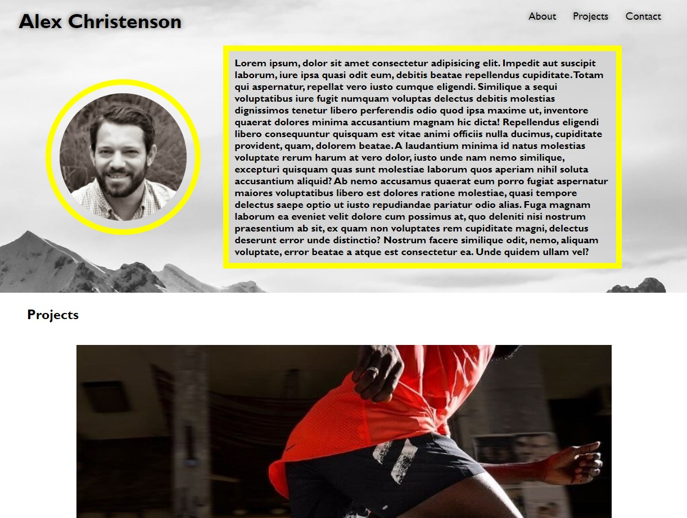
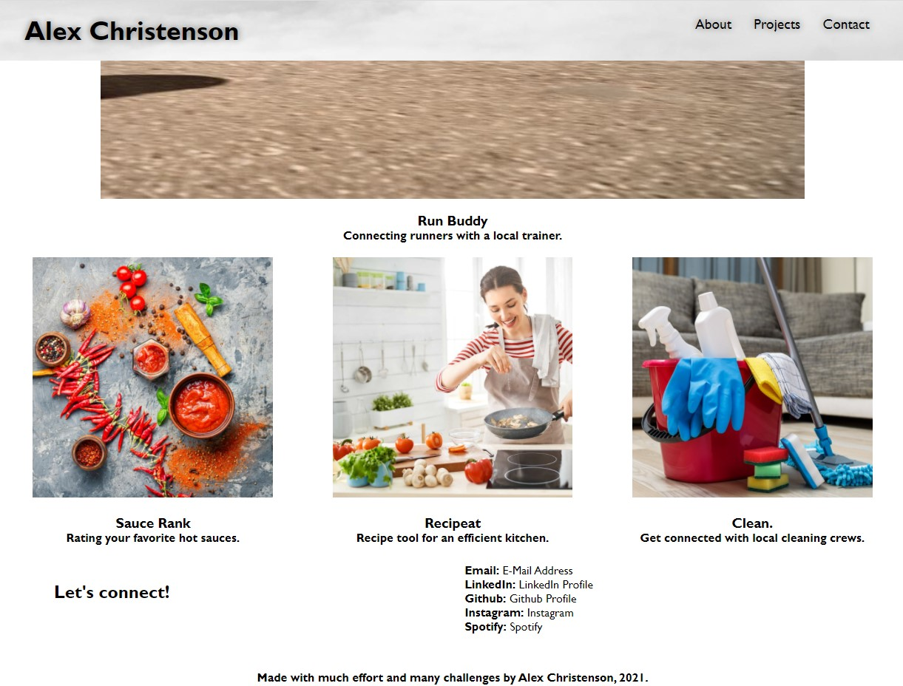
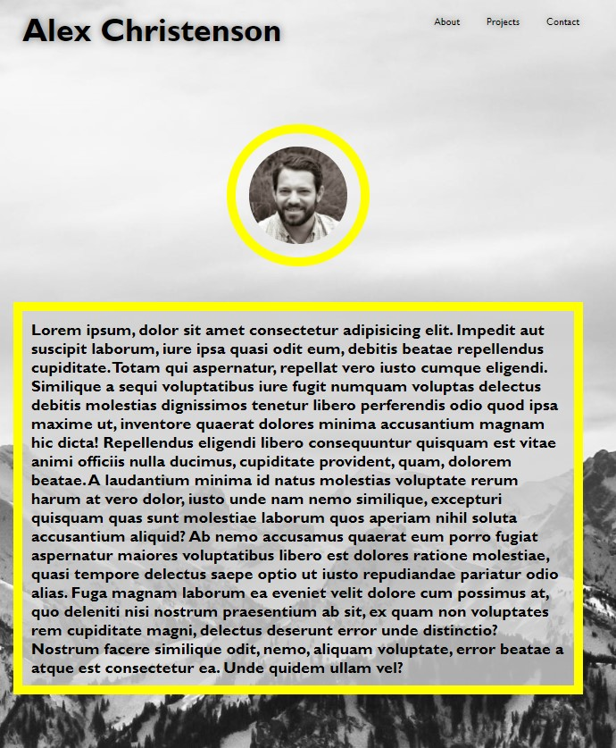
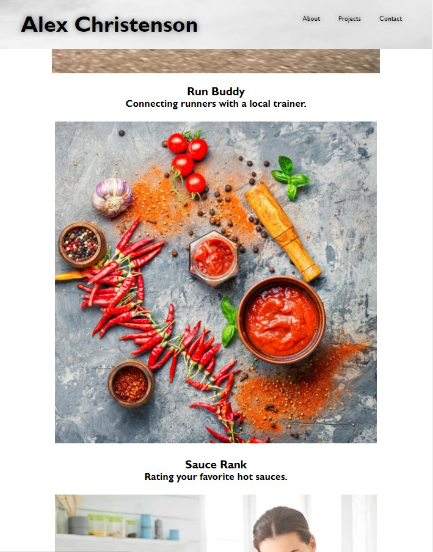

# Alex Christenson Portfolio

## Purpose
Building a professional portfolio page.

## Built With
* HTML
* CSS

## Requirements/Notes
* Portfolio loads correctly without errors
* Portfolio contains a recent photo and links to sections from the header
* Header links work properly and scroll to correct location
* Images are different sizes
* Images are titled and are also functioning links to external sites (dummy projects other than Run Buddy)
* Pictures and about section are responsive for mobile viewing using media queries
* Resembles functionality of assignment mock-up

## Link
https://christenson10.github.io/Portfolio/

## Pictures

## Created by:
Alex Christenson, 2021.

